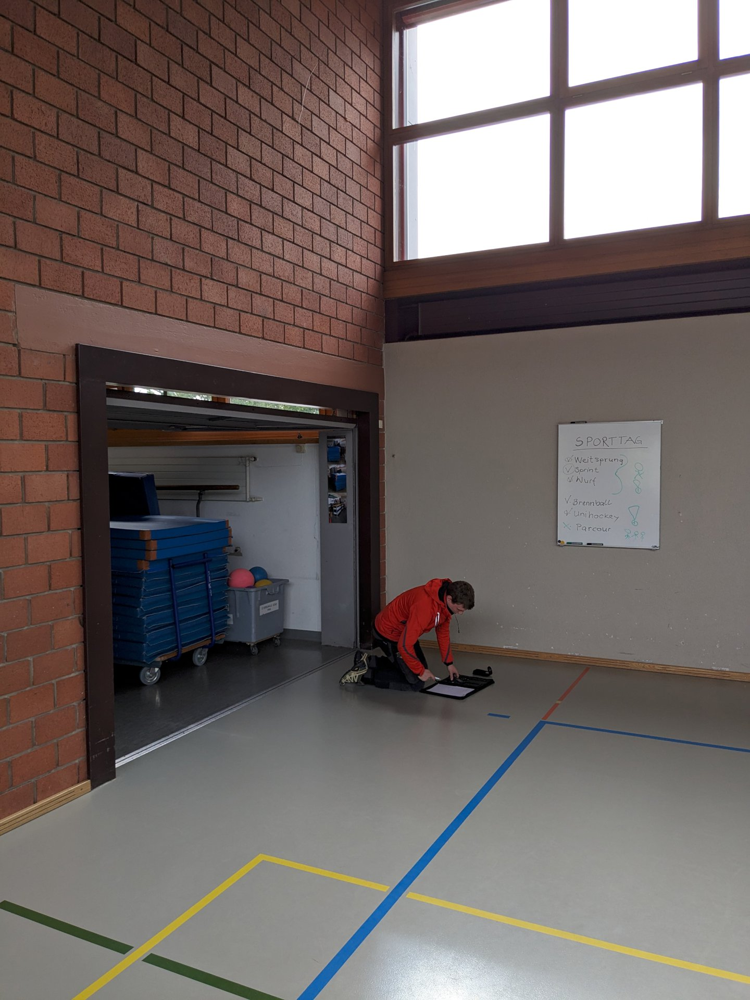
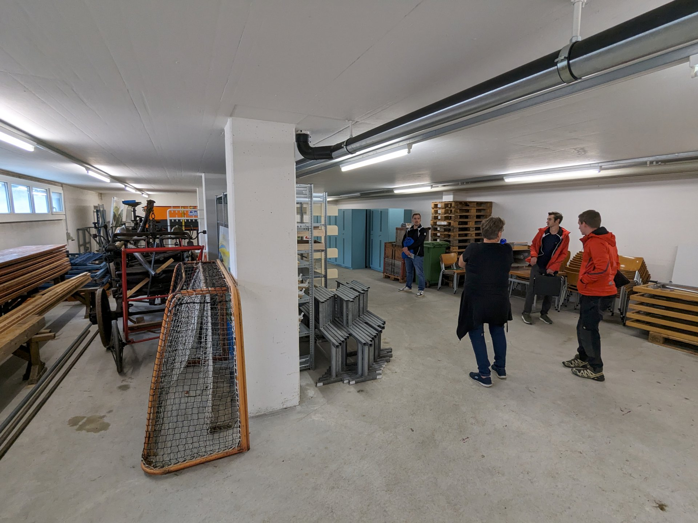
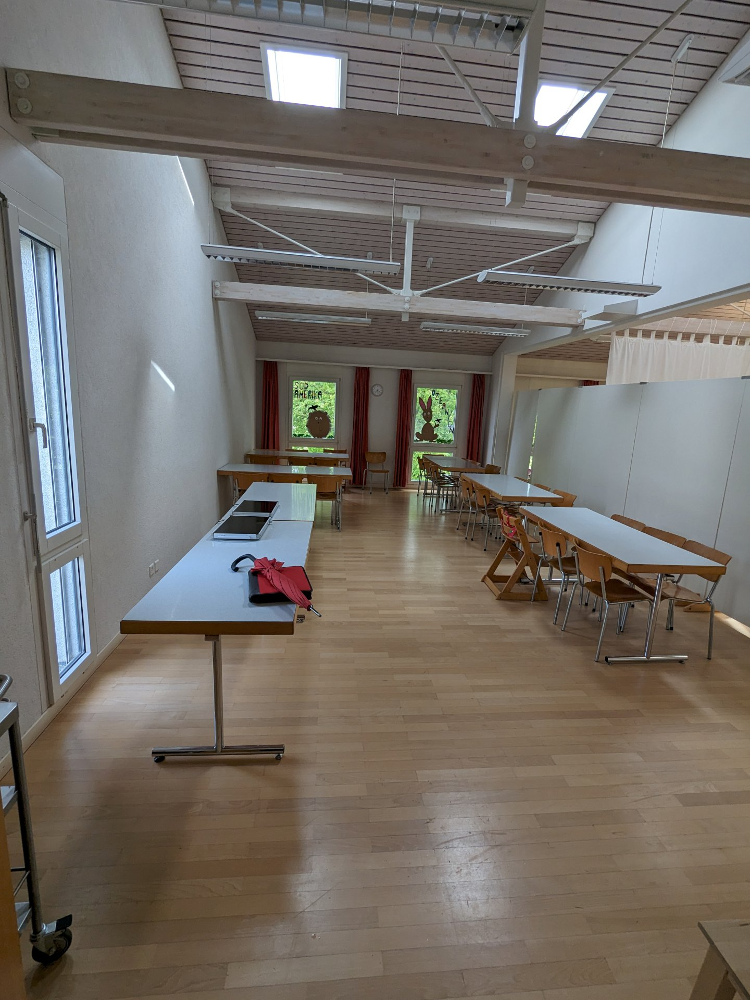
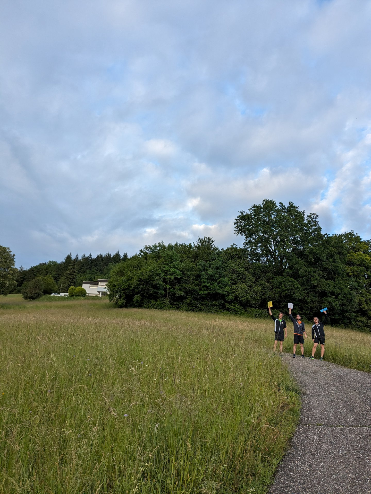
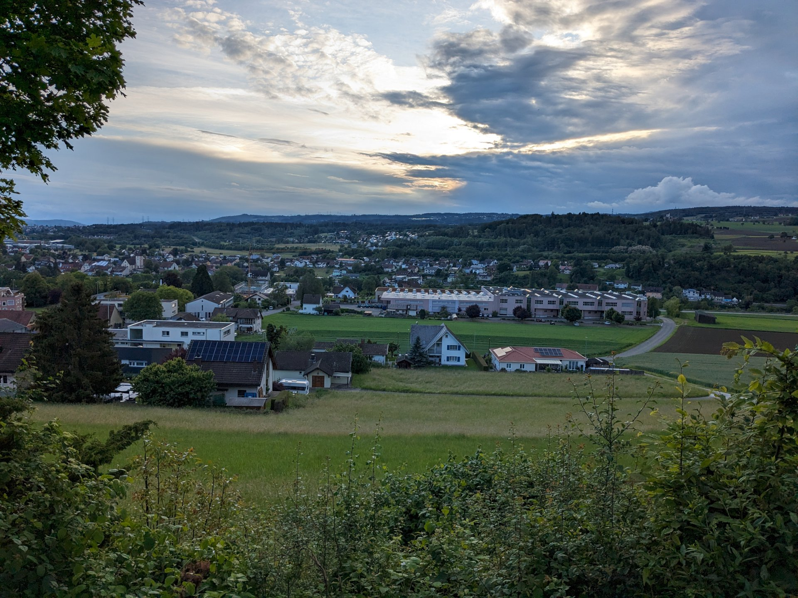
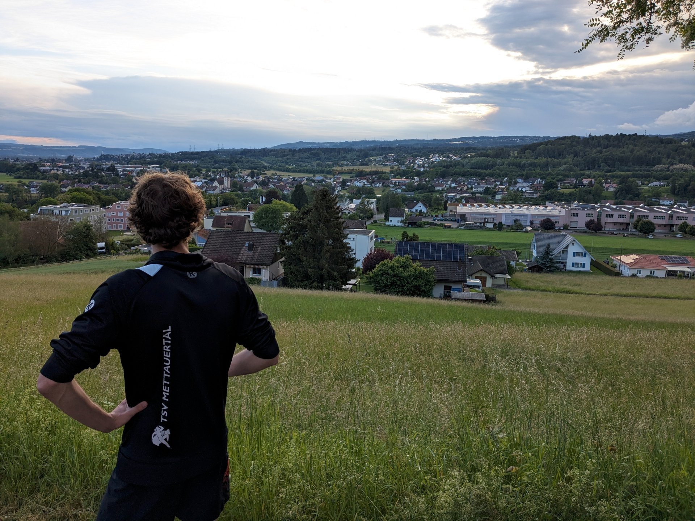

Jehle AG
--------

Heute traf sich ein Teil vom OK auf den Schul- und Sportanlagen in Etzgen,
um gemeinsam die möglichen Anlagestandorte und bereits vorhandene Infrastruktur für das Jugendturnfest zu besichtigen.
Da sich ein Teil davon auf dem Jehleareal befindet,
wurden sie von Martin Hummel (Mitglied der Geschäftsleitung Jehle AG) in Empfang genommen und über das Areal geführt.
Bereits jetzt ein grosses Dankeschön für die Unterstützung von der Seite [Jehle AG](https://www.jehleag.ch/de)!

Gemeindeanlagen und Grünflächen
-------------------------------

Ohne Unterbruch ging es mit der Sichtung der Gemeinde-Infrastruktur weiter.
Die Abwartin, Beatrice Oeschger, hatte dabei manch einen Ratschlag bereit.
Den Abschluss machte der Landwirt Roland Steinacher,
welcher dem TSV die Grünfläche für einen Teil der Wettkampfanlagen zur Verfügung stellt.


  
  
  


Infoflyer Anwohner
------------------

Als Ausklang wurden die Sportkleider montiert und, während der Joggingrunde rund ums Festgelände,
[Infoflyer](2024-05-24_Info_Anstösser_Etzgen.pdf) an die Bewohner verteilt.
Ein Abend, gespickt mit vielen Informationen, ging mit einem guten Gefühl zu Ende.


  
  
  

