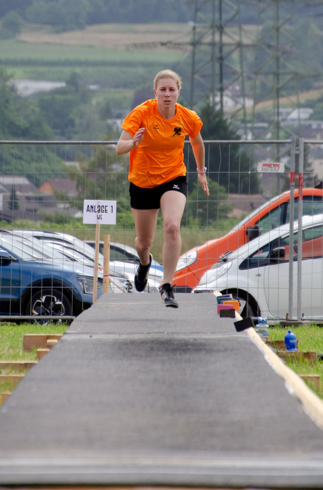
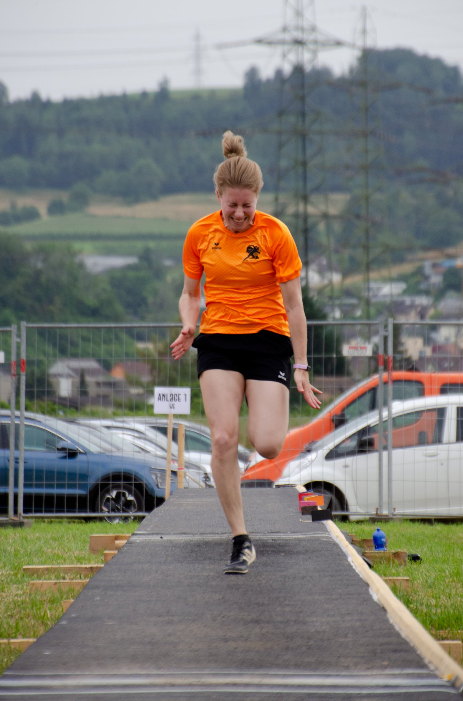
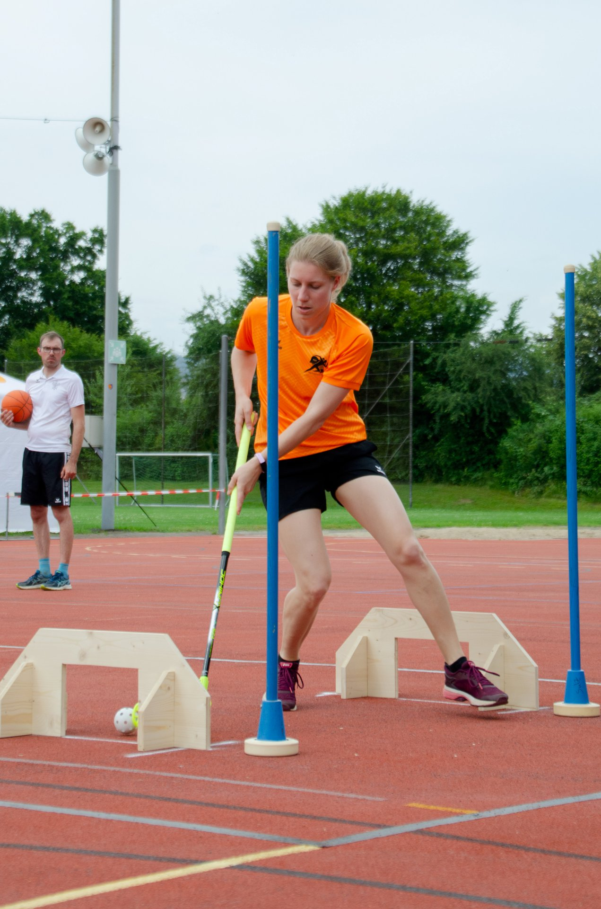
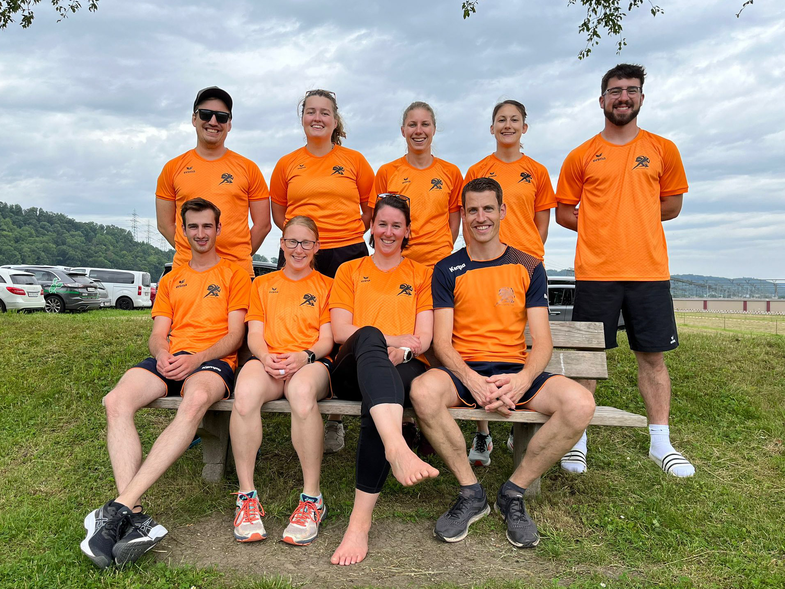
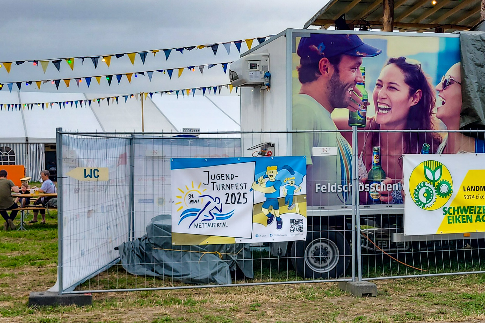
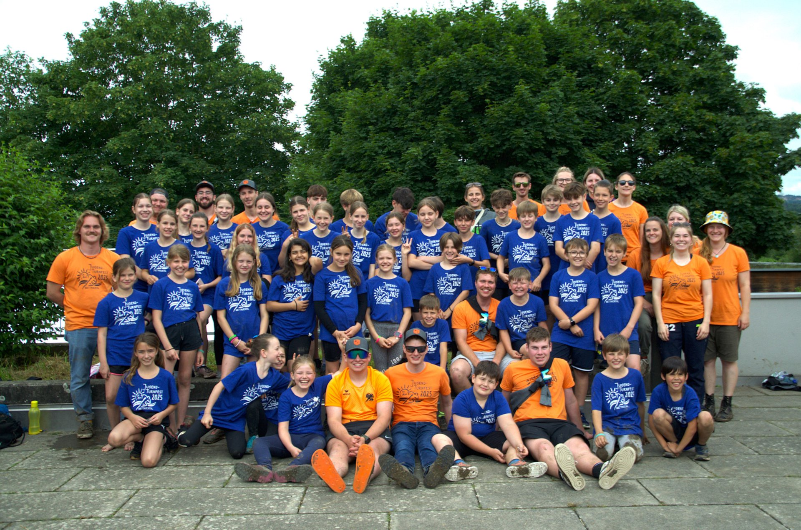
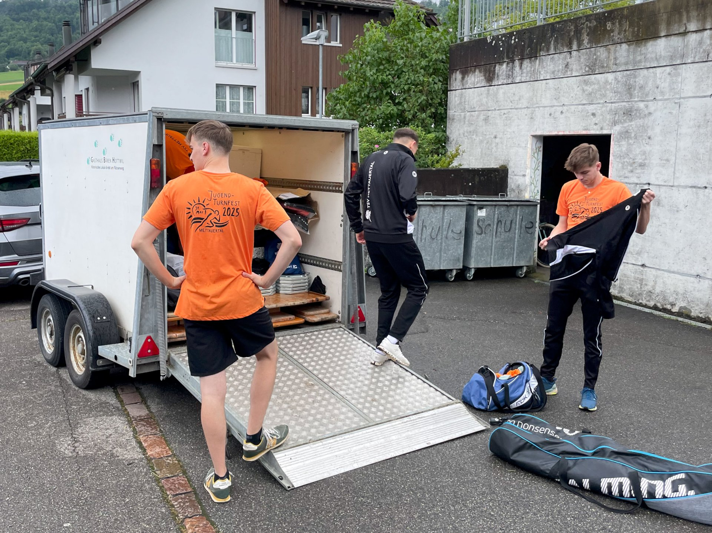
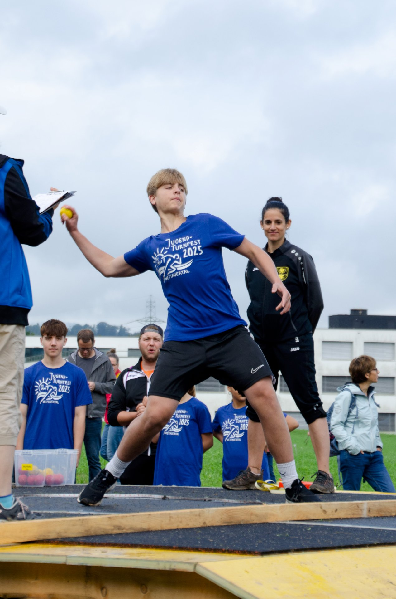

Der Wettkampf
-------------

Das [Turnfest in Laufenburg](https://turnfest2024.ch) am vergangenen Wochenende war eine bunte Mischung an Erlebnissen.
Einerseits war das Wetter leider sehr regnerisch und stürmisch.
Weshalb auch der ein oder andere (oder fast alle) als "Dreckstiefel" unterwegs waren.

Andererseits haben wir durchaus das Beste aus der Situation gemacht,
was auch der Turnfestsieg im Einzelwettkampf von Svenja Erdin deutlich zeigt.
Wir gratulieren ganz herzlich!





Wir waren dabei
---------------

Daneben war der Event in Laufenburg die erste grössere Gelegenheit,
unser eigenes Turnfest bekannter zu machen.
Wir durften eine Blache vor Ort aufhängen, viele Flyer an Interessierte verteilen
und unsere brandneuen Werbe-Shirts tragen.

Falls du unseren Anlass auch bekannter machen willst,
findest du alle Werbematerialien unter [Werbematerial](/marketing/werbematerial).




