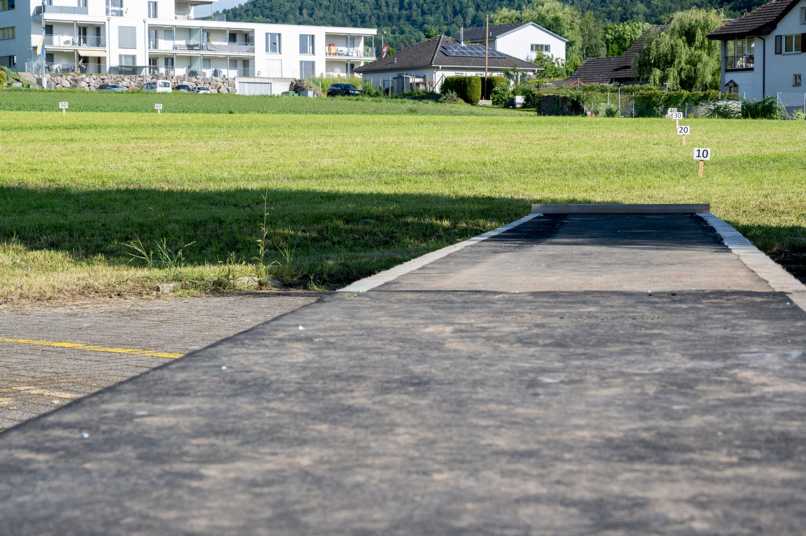

Es dauert nun nicht mehr lange bis zum grossen Tag.
Wir sind sehr gespannt, wie euch unser Festgelände gefällt
und welche sportlichen Leistungen erbracht werden.

Hier nochmals ein paar organisatorische Punkte als Erinnerung:

* Alle nötigen Information zur [Anreise](/turnbetrieb/anreise).
* Alle [Zeitpläne](/turnbetrieb/zeitplane/) wie z.B. für die Vereinsverpflegung.
* Den Link zu den [letzten Weisungen](/turnbetrieb/letzteweisungen).
* Die Übersicht über das Festgelände auf dem Geländeplan hier: [Standort](/turnbetrieb/standort/)

Zudem hier nochmals den Hinweis:

> Bitte beachte, dass wir als kleiner Anlass **Barzahlungen bevorzugen**.
> Twint ist möglich, kann wegen dem schwachen Mobilfunknetz in Etzgen aber eingeschränkt sein.
> Ein Bankomat ist zu Fuss in etwa 10 Minuten Entfernung beim [Restaurant Sonne](https://maps.app.goo.gl/ZXHdKX7eyhJB3aKc8) verfügbar.

Und zu guter Letzt noch ein paar Impressionen vom aktuellen Stand der Aufbauarbeiten:


  
  
  
  
  
  
  
  
  

