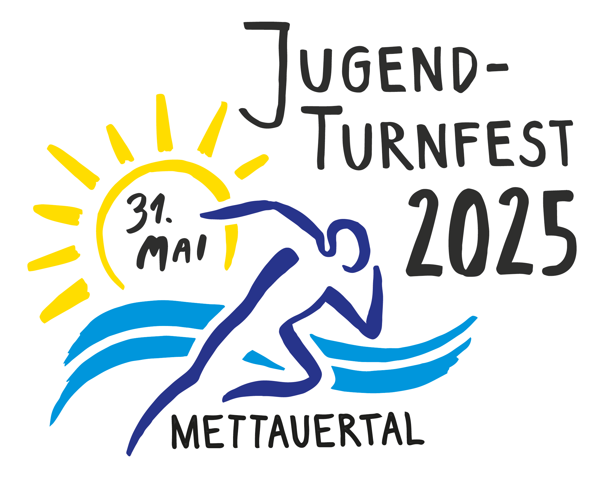

Am Anfang war das Logo
----------------------

Beim Aufgleisen eines Grossanlasses sind viele wichtige Dinge zu bedenken und zu entscheiden.
Welche Personen könnten geeignet für die Mitarbeit im OK sein?
Welche gemeinschaftlichen und finanzielle Ziele möchten wir erreichen?
Und wie möchten wir den Anlass bewerben und in ein gutes Licht rücken?

Bei der letzten Frage bemerkt man schnell,
dass der Anlass irgendeine Art visuelle Darstellung benötigt,
welche den Leuten in Erinnerung bleibt.
Und da kommt, neben einem geeigneten Namen, auch schnell ein Logo ins Spiel.
Denn mit Logo macht sich ein offizieller Brief, ein Helfershirt und vor allem eine Homepage viel besser.

Von Hand gezeichnet
-------------------

In unserem Fall hat Lara Oeschger auf Anfrage von Kevin Müller sich dieser Aufgabe angenommen
und nach zwei kreativen Sitzungen und vielen Entwürfen unser Logo von Hand gezeichnet.
Dieses beinhaltet die drei wichtigsten Teile, welche unseren Anlass verbinden: den Verein, die Gemeinde und die Jugend.
Der letzte Schliff und die Digitalisierung erfuhr das Logo durch Katharina Chettata-Schmidt.

Danke an alle, die zu diesem stimmigen "Bild" unseres Anlasses beigetragen haben.
 

Zeig es weiter
--------------

Falls du dich auch so auf unseren Anlass freust wie wir, zeig das Logo doch weiter.
Du findest es, und z.B. auch QR-Codes, unter [Werbematerial](/marketing/werbematerial).
