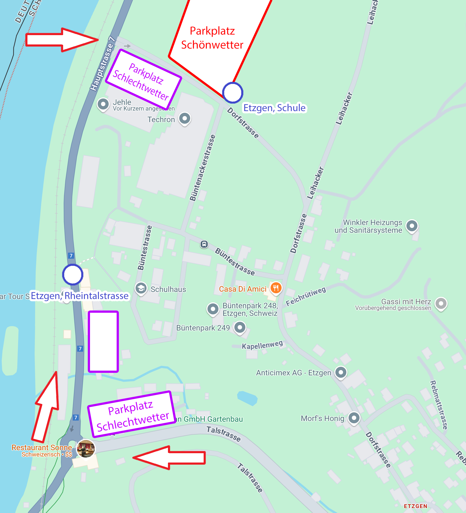

Anreise mit ÖV
--------------

Die Anreise mit ÖV ist aus diversen Richtungen möglich.
In allen Fällen steigt ihr an der Bushaltestelle **Etzgen, Schulhaus** aus.

**Achtung**: Diese Haltestelle wird wegen dem Jugendturnfest an die Dorfstrasse verschoben.
Sie befindet sich somit direkt am Rand des Festgeländes.

* Aus der Richtung Laufenburg nehmt ihr den **Bus 142 Richtung Brugg**.
* Aus der Richtung Brugg nehmt ihr den **Bus 142 Richtung Laufenburg**.
* Aus der Richtung Döttingen nehmt ihr den **Bus 149 Richtung Laufenburg**.

Falls ihr eine Verbindung nehmen müsst, welche nicht durch Etzgen Dorf fährt,
könnt ihr auch bei der Haltestelle **Etzgen, Rheintalstrasse** aussteigen
und die Treppe Richtung Bruderklausen-Kapelle und Schulhaus nehmen.

ÖV Gruppenreise anmelden
------------------------

**Bitte reserviert** für eure Reisegruppen unbedingt bei der SBB.
PostAuto wird anschliessend die Fahrten koordinieren
und wenn nötig zusätzliche Kursfahrten anbieten
oder mit den Turnvereinen direkt eine Alternativverbindung suchen.

**Gruppenreisen und -billette** erhaltet ihr online auf
[SBB - Gruppenbillette buchen](https://www.sbb.ch/de/billette-angebote/billette/gruppenbillette-schweiz.html),
an bedienten Verkaufsstellen des Öffentlichen Verkehrs
oder telefonisch beim SBB Contact Center: 0848 44 66 88 (CHF 0.08/Min.).

Weitere Infos findet ihr auch unter:
**[SBB - Infos Gruppenreisen](https://www.sbb.ch/de/hilfe-und-kontakt/produkte-services/freizeit-gruppenangebote/gruppenreisen.html)**

Anreise mit PKW und Parkplätze
------------------------------

Die Anreise per Auto ist ebenfalls gut machbar.
Wir haben einen grossen Parkplatz (rot) direkt am Rand des Festgeländes.
Diesen erreicht ihr am Besten über die **Kreuzung Haupstrasse-Dorfstrasse**.

Aus Richtung Laufenburg und Brugg fahrt ihr dazu am Kreisel beim Restaurant Sonne vorbei.
Aus Richtung Döttingen ist die Kreuzung direkt vor dem Dorfeingang links.

Im Schlechtwetterfall können wir den grossen Parkplatz (rot) auf dem Feld nicht benutzten.
In diesem Fall wird euch der Verkehrsdienst auf die Schlechtwetter-Parkplätze (violett) verteilen.
