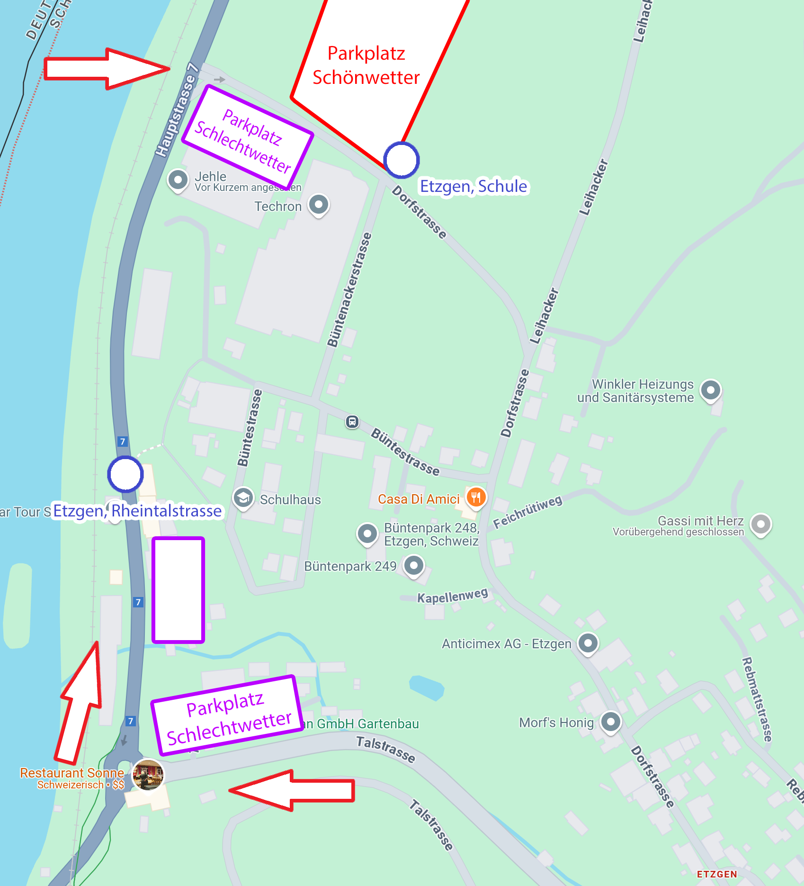

Ortschaft
---------

Das Turnfest findet in
[Etzgen AG](https://www.google.ch/maps/place/5275+Etzgen/@47.5742997,8.107697,448m/data=!3m1!1e3!4m6!3m5!1s0x479043f58d2b21c9:0x400ff8840194c10!8m2!3d47.5704441!4d8.1111217!16zL20vMGZ5dzVi?entry=ttu)
statt.
Der Wettkampfplatz befindet sich in der Nähe des Jehle-Areals und der Schul- und Sport-Anlagen.

Geländeplan
-----------

Unser Festgelände ist sehr kompakt aufgebaut, weshalb ihr alle Anlagen innert weniger Schritte erreichen könnt.

Infostand und Fundbüro
----------------------

Den Infostand und das Fundbüro findest du bei der **Anmeldung (Nr. 12)**.
Detailinfos hier: [Infostand und Fundbüro](/organisation/infostand)

Anreise mit ÖV
--------------

Die Anreise mit ÖV ist aus diversen Richtungen möglich.
In allen Fällen steigt ihr an der Bushaltestelle **Etzgen, Schulhaus** aus.

**Achtung**: Diese Haltestelle wird wegen dem Jugendturnfest an die Dorfstrasse verschoben.
Sie befindet sich somit direkt am Rand des Festgeländes.

* Aus der Richtung Laufenburg nehmt ihr den **Bus 142 Richtung Brugg**.
* Aus der Richtung Brugg nehmt ihr den **Bus 142 Richtung Laufenburg**.
* Aus der Richtung Döttingen nehmt ihr den **Bus 149 Richtung Laufenburg**.

**Bitte reserviert** für eure Reisegruppen ganz normal bei der SBB.
Die SBB ist über unseren Anlass informiert
und wird bei entsprechenden Reservationen mehr Verkehrsmittel zur Verfügung stellen.

Falls ihr eine Verbindung nehmen müsst, welche nicht durch Etzgen Dorf fährt,
könnt ihr auch bei der Haltestelle **Etzgen, Rheintalstrasse** aussteigen
und die Treppe Richtung Bruderklausen-Kapelle und Schulhaus nehmen.

Anreise mit PKW und Parkplätze
------------------------------

Die Anreise per Auto ist ebenfalls gut machbar.
Wir haben einen grossen Parkplatz (rot) direkt am Rand des Festgeländes.
Diesen erreicht ihr am Besten über die **Kreuzung Haupstrasse-Dorfstrasse**.

Aus Richtung Laufenburg und Brugg fahrt ihr dazu am Kreisel beim Restaurant Sonne vorbei.
Aus Richtung Döttingen ist die Kreuzung direkt vor dem Dorfeingang links.

Im Schlechtwetterfall können wir den grossen Parkplatz (rot) auf dem Feld nicht benutzten.
In diesem Fall wird euch der Verkehrsdienst auf die Schlechtwetter-Parkplätze (violett) verteilen.
